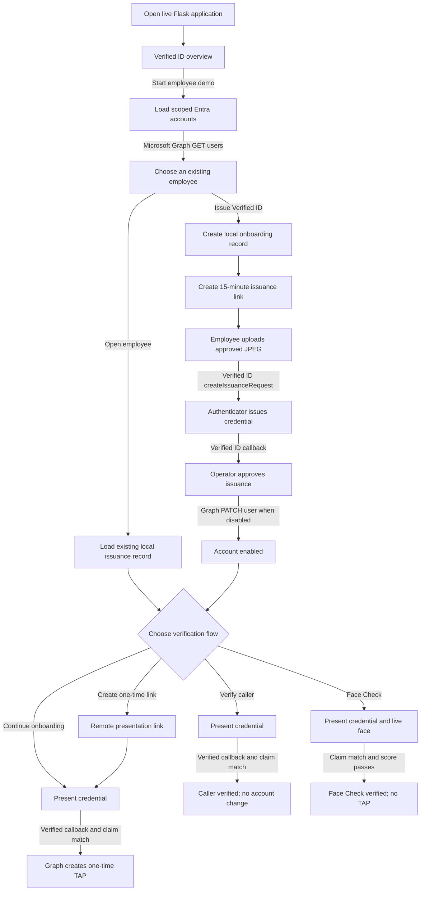

# Demo Flow, API Calls, and Configuration

**Author:** Kevin Tigges  
**Date:** September 22, 2026

This document describes what the demo does, which Microsoft services it calls, what it validates, and which settings control each step.

## Scope

The demo uses existing Microsoft Entra users. It does not create or delete accounts, add users to the demo scope, update profile photos, reset passwords, or inspect credentials held in Authenticator.

A separate administrative, HR, or identity-governance process must:

1. Create the Entra account.
2. Populate `givenName`, `surname`, `jobTitle`, `department`, and `otherMails`.
3. Set `officeLocation` to the value in `demoOfficeLocation`.
4. Leave the account disabled if this demo will enable it after approval.

The application can read those users, issue a credential, enable the selected account after approval, and create a Temporary Access Pass (TAP) after successful onboarding verification.

## High-Level Flow

The standalone `VerifiedID.html` file is a presentation and simulated briefing; it does not call the Flask application. The live application starts at `http://localhost:8080`. Its **Verified ID overview** page is `/overview`, and **Start employee demo** returns to `/`.



## Service Authentication

Both service clients use the configured app registration with the client-credentials flow through MSAL:

- Authority: `https://login.microsoftonline.com/{entraTenantId}`
- Client: `entraClientId`
- Secret: `entraClientSecret`
- Graph scope: `https://graph.microsoft.com/.default`
- Verified ID scope: `3db474b9-6a0c-4840-96ac-1fceb342124f/.default`

The Verified ID token must contain an accepted Verifiable Credentials application role. Graph operations require the application permissions listed in the README and tenant admin consent.

## Page and Action Flow

### Load the employee list

Opening `/` renders the employee picker and calls:

```http
GET https://graph.microsoft.com/v1.0/users
ConsistencyLevel: eventual
```

Query parameters:

```text
$filter=officeLocation eq '{demoOfficeLocation}'
$count=true
$select=id,userPrincipalName,otherMails,givenName,surname,displayName,jobTitle,department,officeLocation,accountEnabled
```

Microsoft Graph treats filtering users by `officeLocation` as an advanced directory query. It therefore requires both `$count=true` and `ConsistencyLevel: eventual`. The application does not use the returned count; `$count=true` enables the advanced query mode. `eventual` means the indexed query result can briefly lag behind a recent directory change.

The client follows `@odata.nextLink` for additional pages. The picker includes only live Entra users with the exact configured Office location. Local state is joined by immutable Entra object ID to show whether this demo previously received a successful issuance callback.

This is a read-only Graph operation. It does not create accounts.

### Open employee

**Open employee** posts to `/demo/select-employee` with the selected Entra object ID. The application calls:

```http
GET https://graph.microsoft.com/v1.0/users/{user-id}
```

It validates that the user still exists and still has the configured `officeLocation`. It then finds the newest successfully issued record for that object ID in `.demo_onboarding_state.json`, clears old presentation results, refreshes the account-enabled flag, and opens the employee page.

The app cannot discover wallet contents through Graph. If this demo has no retained successful issuance record, **Open employee** stops with an error.

### Issue Verified ID

**Issue Verified ID** also loads the selected user with `GET /users/{user-id}`. Before creating local state, it requires:

- Exact `officeLocation` match.
- Populated `givenName`, `surname`, `jobTitle`, and `department`.
- At least one personal delivery address in `otherMails`.

The application creates an `EMP-XXXXXXXX` credential reference and an onboarding record in `.demo_onboarding_state.json`. It does not modify the Entra account.

### Send credential link

**Send credential link** creates a random, 15-minute, single-use token. Only its SHA-256 hash and expiry are stored locally.

When `onboardingEmailEnabled` is `true`, the application asks Graph to send the link from `onboardingSenderUpn` to the first address in `otherMails`:

```http
POST https://graph.microsoft.com/v1.0/users/{onboardingSenderUpn}/sendMail
```

A `202 Accepted` response means Graph accepted the delivery request; it does not prove delivery. The page also displays the link directly. When email is disabled, no Graph mail call is made.

### Start credential issuance

The employee opens `/issue/{token}`, selects an approved JPEG, and starts issuance. The application checks that:

- The invitation exists, has not expired, and has not been used.
- The upload is a valid JPEG no larger than 10 MB.
- The image is at least 200 by 200 pixels.
- EXIF orientation is applied.
- The normalized image can be resized and compressed below 1 MB.

The token is then consumed. The photo is encoded in memory and sent as the `photo` claim; the app does not retain the uploaded image.

The application calls:

```http
POST {msIdentityHostName}/verifiableCredentials/createIssuanceRequest
```

The payload uses:

- `DidAuthority` as the issuer authority.
- `clientName` for the wallet registration display.
- `CredentialType` and `CredentialManifest` for the credential contract.
- Employee name, UPN, job title, department, generated reference, and photo as claims.
- `issuancePinCodeLength` to generate the numeric issuance PIN.
- `publicBaseUrl` for the callback URL.
- A random state value and callback API key for correlation and callback authentication.

Verified ID returns a request ID, wallet URL, and QR code. Authenticator handles user consent and credential storage. The browser polls the local status endpoint while Verified ID posts asynchronous results to `/api/verifiedid/callback`.

For an `issuance_successful` callback, the app verifies the callback API key and random state, records the result, and waits for operator approval.

### Approve and enable the account

**Approve credential** changes only local workflow state. If the selected Entra account is already enabled, the workflow proceeds without a Graph write.

For a disabled account, **Enable Entra account** first reloads the exact user and rechecks `officeLocation`, then calls:

```http
PATCH https://graph.microsoft.com/v1.0/users/{user-id}
Content-Type: application/json

{"accountEnabled": true}
```

This is the only account-property change made by the demo.

### Continue onboarding

**Continue onboarding** posts directly to the Verified ID Request Service:

```http
POST {msIdentityHostName}/verifiableCredentials/createPresentationRequest
```

The request asks for `CredentialType`, limits accepted issuers to `acceptedIssuers`, uses `purpose` as the wallet message, and supplies a new random callback state. Authenticator asks the holder to present the credential.

On the `presentation_verified` callback, the app:

1. Validates the callback API key and correlates the random state.
2. Reads the first verified credential returned by the Request Service.
3. Compares its employee reference and email with the selected local record using constant-time comparisons.
4. Creates access only when both claims match.

With `accessMode` set to `graphTap`, it calls:

```http
POST https://graph.microsoft.com/v1.0/users/{user-id}/authentication/temporaryAccessPassMethods
Content-Type: application/json

{"lifetimeInMinutes": tapLifetimeMinutes, "isUsableOnce": true}
```

If Graph reports a tenant-enforced lifetime range, the client retries once with a supported value. The returned TAP is displayed in the browser. When `accessMode` is not `graphTap`, the app creates a local six-digit demonstration code that Entra will not accept.

### Create one-time link

**Create one-time link** creates a 15-minute, single-use remote presentation token for either onboarding or help-desk verification. It stores only the token hash, context, expiry, and used flag. Creating the link does not call Microsoft.

When the recipient opens `/verify/{token}` and selects start, the token is consumed and the application makes the same `createPresentationRequest` call used by the selected flow. Face Check intentionally has no remote-link option in this demo.

### Verify help-desk caller

**Verify help-desk caller** creates a presentation request with a help-desk-specific purpose. The callback and employee-claim checks are the same as onboarding, but a successful match only records `helpdesk_verified`.

It does not create a TAP, reset a password, change authentication methods, or modify the Entra account. Any later help-desk action belongs to a separate governed process.

### Start Face Check

**Start Face Check** creates a presentation request containing this additional validation policy:

```json
{
  "allowRevoked": false,
  "validateLinkedDomain": true,
  "faceCheck": {
    "sourcePhotoClaimName": "photo",
    "matchConfidenceThreshold": 70
  }
}
```

The threshold comes from `faceCheckMatchConfidenceThreshold`. Authenticator performs liveness and compares the live capture with the credential's `photo` claim. The app receives the result and confidence score, not the selfie footage.

The app still requires the presented employee reference and email to match the selected local record. It records `facecheck_verified` only when the score is present and meets the configured threshold. Face Check does not create a TAP or change the account.

## Callback and Local Validation

Verified ID callbacks are accepted only when:

- The `api-key` header matches the local callback key using a constant-time comparison.
- The callback `state` matches a current issuance or presentation request.
- The request status is appropriate for that state.

Presentation success also requires the returned `employeeId`/`employee_id` and `email` claims to match the selected onboarding record. The Request Service performs credential, issuer, and requested validation; the application performs this additional business-record match before releasing any result.

The browser polls:

```http
GET /api/onboarding/{onboarding-id}/status
```

This local endpoint returns workflow status and callback diagnostics. It does not call Microsoft.

## Microsoft Calls by Action

| User action | External call | Result or directory change |
|---|---|---|
| Load demo | Graph `GET /users` | Reads scoped accounts |
| Open employee | Graph `GET /users/{id}` | Reads one account and opens retained local state |
| Issue Verified ID | Graph `GET /users/{id}` | Validates one existing account; creates local state only |
| Send credential link | Graph `POST /users/{sender}/sendMail` when enabled | Requests email delivery |
| Start issuance | Verified ID `createIssuanceRequest` | Creates a wallet issuance request |
| Approve credential | None | Updates local state only |
| Enable account | Graph `GET /users/{id}`, then `PATCH /users/{id}` | Sets `accountEnabled` to `true` |
| Continue onboarding | Verified ID `createPresentationRequest`; Graph TAP call after successful callback | Verifies claims, then creates one TAP |
| Create one-time link | None until recipient starts it | Stores a local token hash; then starts the chosen presentation |
| Verify help-desk caller | Verified ID `createPresentationRequest` | Records a match; no Graph write |
| Start Face Check | Verified ID `createPresentationRequest` with Face Check validation | Records passing confidence; no Graph write |
| Poll request status | None | Reads local workflow state |

## Configuration Reference

Values are loaded from `config.json`. Matching environment variables override file values; both the JSON-style name and documented uppercase form are accepted. Do not commit secrets.

| Setting | Default | Used for |
|---|---:|---|
| `entraTenantId` | Required | Entra tenant used for MSAL authority |
| `entraClientId` | Required | App registration client ID |
| `entraClientSecret` | Required | App-only client credential |
| `DidAuthority` | Required | Verified ID issuer DID and default accepted issuer |
| `CredentialManifest` | Required | Published custom credential manifest URL |
| `CredentialType` | `VerifiedEmployeeCard` | Issued and requested credential type |
| `acceptedIssuers` | `DidAuthority` | Semicolon-separated issuer DIDs accepted during presentation |
| `organizationName` | `Example Organization` | Application display name |
| `clientName` | `Employee Verified ID Demo` | Client name shown in Verified ID requests |
| `purpose` | `Present your employee credential to continue` | Onboarding presentation message |
| `issuancePinCodeLength` | `4` | Numeric wallet issuance PIN length; `0` disables it |
| `accessMode` | `graphTap` | `graphTap` creates a real TAP; another value creates a local demo code |
| `tapLifetimeMinutes` | `60` | Requested one-time TAP lifetime |
| `faceCheckMatchConfidenceThreshold` | `70` | Required Face Check score; values outside 50-100 revert to 70 |
| `demoOfficeLocation` | `VIDDEMO` | Exact Graph filter and scope marker |
| `onboardingEmailEnabled` | `false` | Enables the Graph `sendMail` request |
| `onboardingSenderUpn` | Empty | Mailbox used to send issuance links |
| `publicBaseUrl` | Empty | Public HTTPS origin used for links and callbacks |
| `msIdentityHostName` | `https://verifiedid.did.msidentity.com/v1.0/` | Verified ID Request Service base URL |
| `port` | `8080` | Local Flask listening port |
| `debug` | `true` | Flask debug mode |

Runtime-only values:

- `apiKey` is read from `CALLBACK_API_KEY` or generated in `.callback_api_key` with owner-only permissions.
- `vcServiceScope` is fixed to the Verified ID Request Service application scope.
- `acceptedIssuersList` is parsed from the semicolon-separated `acceptedIssuers` value.
- `flaskSecretKey` may be provided in loaded configuration; otherwise a new in-memory value is generated at startup.

Live issuance and presentation are blocked until required tenant, app, DID, manifest, credential type, and accepted-issuer values are present. Enabling email also requires `onboardingSenderUpn`.

## Credential Contract Files

The files under `credentials/` define the custom credential that must be published in Entra Verified ID:

- `VerifiedEmployeeCard-rules.json` maps the issuance request claims, including `photo`, into the signed credential.
- `VerifiedEmployeeCard-display.json` controls labels and identifies the photo as a Base64 JPEG image.

The Flask app does not upload or publish these files. `CredentialManifest` must point to the contract already published in the tenant. The service client includes a manifest-fetch helper for diagnostics, but no current page or workflow calls it; live issuance sends the configured manifest URL to the Verified ID Request Service.

## Local State

`.demo_onboarding_state.json` connects each browser workflow to one immutable Entra object ID. It retains employee claims copied at selection time, generated credential references, status, timestamps, hashed invitation tokens, callback states and request IDs, approval, errors, account-enabled state, TAP/demo-code output, and Face Check score.

Writes use a process lock, a temporary file, atomic replacement, and owner-only file permissions. This is sufficient for a single-process demonstration, not for multiple application instances or production recovery. The file does not contain uploaded photos, wallet private keys, wallet tokens, or Face Check footage.
